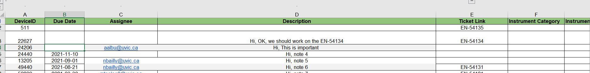
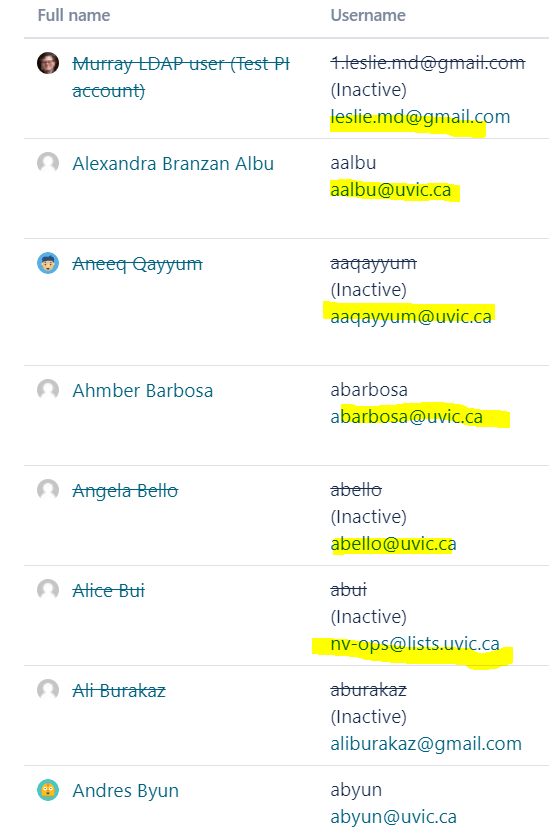
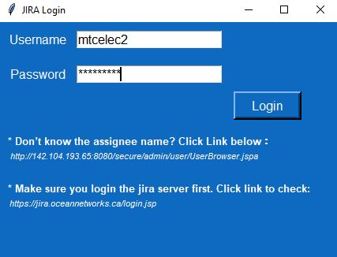
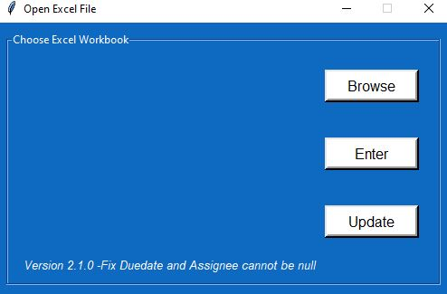
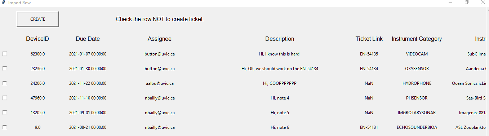
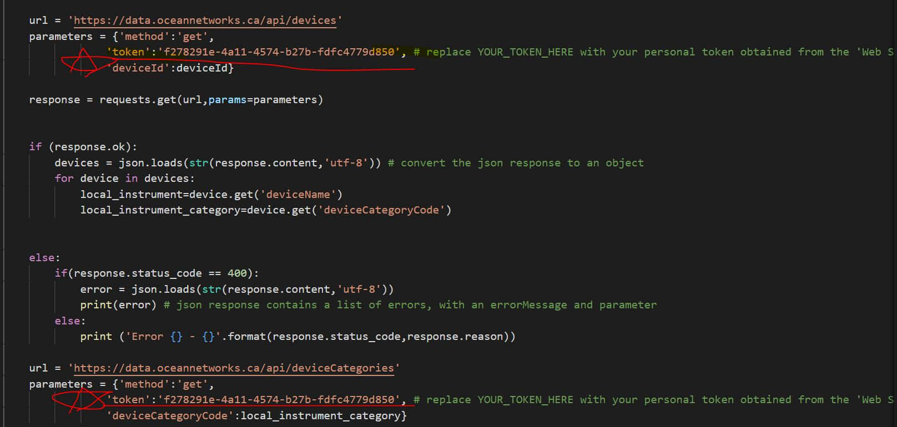

# Overview:
Jira Ticket Generator(JTG) is an application that helps MTC staff automatically process information from Excel sheets and generate JIRA tickets. Before you use this application please carefully read the information below.
## Input Section:
As figure 1 shown, there are 5 cells that need to be filled for each device.
#### DeviceID(Necessary): 
(Number) The device Id of the instrument that needs to be deployed.
#### Due Date(option):
(YYYY-MM-DD) the due day of this issue. Please be careful, using exactly date format as I provided.
#### Assignee(option):
(email) link the ticket to the specific assignee, in this section please enter the email address that the user used in Jira registration. The example is shown in figure 2.
#### Description(option):
(String)This place is for adding notes to the ticket.
#### Ticket Link: (option):
(EN-XXXX)If users want to link to an existing ticket, they can insert the existing ticket EN number to this cell.

**if you don’t know any information about 2-5, you can leave it blank.**

                                                              _figure 1, input sample_
                                                              
   

_figure 2, assignee sample _                                                            
                                                              
## Login Section:
After you click the .exe file, you are required to enter your JIRA login information including username and password. If the program shows a login error and your information is correct, please manually login through the website ‘https://jira.oceannetworks.ca/’ and remember me log in on this computer. After that re-open the program.

_figure 3, login window_

## Excel process section:

After logging in, you will see a window like shown in figure 4, click ‘Browse’ to locate your Excel file. Then click enter to process and request unknown information from the ONC database. It might take a few seconds because the program needs to send requests to the ONC server and get the instrument name, instrument category and serial number.

   

_figure 4,browsing window_   

## Preview Section:
In the create section you will see a preview page before the creation. (figure 5) Double-check with the data you provided and request data from the ONC database. If any of these devices you don’t want to create a ticket, section the check box at the front, then click the ‘CREATE’ button. Ticket will automatically be generated and all the data will export to a new Excel file call: ‘youExcelName_output.xlsx’.  The new file will have all the new ticket link and current status on it. 

_figure 5, preview section_

## Status Update Section:
As shown in figure 4, if you want to know each ticket status condition, you only need to browse to the youExcelName_output.xlsx file and click update, all the status will be updated and rewritten to the Excel file.

***Note: This program is still a BETA version. If you facing any issues or bugs please contact me.***

## QA Section : 
#### 1. Why the program show me the error _401-Unauthorized_?

#### Answer: 
This error means the connection between the ONC server and your computer is unauthorized because the default connection TOOKEN has expired. You need replace YOUR_TOKEN with your personal token obtained from the 'Web Services API'. Click https://wiki.oceannetworks.ca/display/O2A/API+Reference for more information. All Web Services require a token. This can be generated, after logging in at http://data.oceannetworks.ca/Profile. Click the "Web Services" tab, then click "Generate Token". Replace location in request.py 

#### 2. Why I can't login ? 

#### Answer :
There might be two possible error lead to this problem, 1) your username and password are wrong, please double-check and enter again. 2) JIRA API hasn't generated a correct access TOKEN for you. Please go to https://jira.oceannetworks.ca/login.jsp login again and mark the remember me on this computer box. After that re-login using the application.

